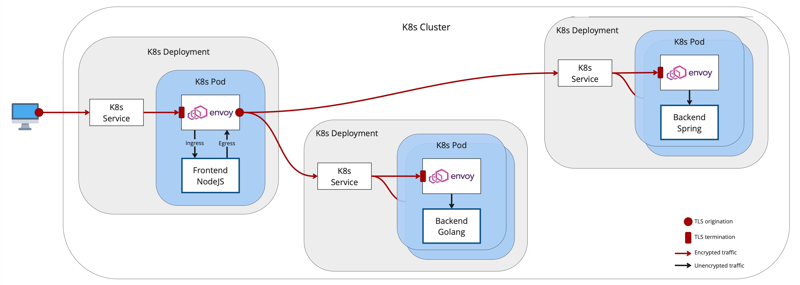

# Envoy Sidecar

This is a clone of https://github.com/mouton0815/hello-kubernetes with the difference that every application has an
[Envoy](https://www.envoyproxy.io) sidecar.

Sidecar and application reside in the same Kubernetes Pod.
The sidecar proxies incoming traffic and acts as router for outgoing traffic.

All sidecar proxies terminate incoming TLS connections and use HTTP for communication with their main application.
The frontend sidecar proxy additionally originates TLS encryption for the communication with the two backend services.
That way, all traffic outside K8s, and all traffic between Pods is encrypted. Only the traffic within a Pod uses plain HTTP. 




## Preconditions
You need running Docker and Kubernetes installations, either on your workstation or at a public cloud provider.

For example, both Docker and Kubernetes come with [Docker Desktop](https://www.docker.com/products/docker-desktop) available for Mac and Windows.
An alternative is [minikube](https://kubernetes.io/docs/setup/learning-environment/minikube/), which also runs on Linux.

To create a self-signed TLS certificate, you also need [OpenSSL](https://www.openssl.org) installed.

## Create Certificate
```shell
$ sh create-certificate.sh
```

## Build Docker Images

```shell
$ sh build-images.sh
```

## Deploy to Kubernetes
```shell
$ kubectl apply -k .
```

The services `backend-spring` and `backend-golang` do not expose their endpoints to the outside (they use the default service type `ClusterIP`).

Service `frontend-nodejs` has type [LoadBalancer](https://kubernetes.io/docs/concepts/services-networking/service/#loadbalancer).
If you run Docker Desktop, there is nothing additional to do, because Docker Deskop exposes services of type `LoadBalancer` to `localhost`.
You should be able to access the application from a web browser  
```
curl --cacert tls.crt https://localhost/World 
```
If your Kubernetes runs on a public cloud, you need to create an [Ingress](https://kubernetes.io/docs/concepts/services-networking/ingress/) service
that connects to the cloud provider's load balancer. Alternatively, you can set up an own load balancer like [ingress-nginx](https://github.com/kubernetes/ingress-nginx).